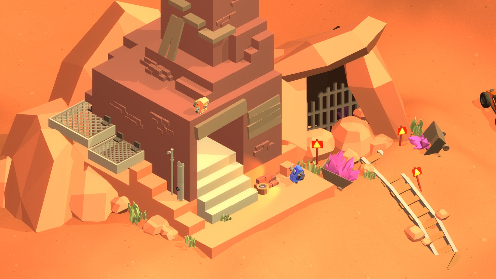
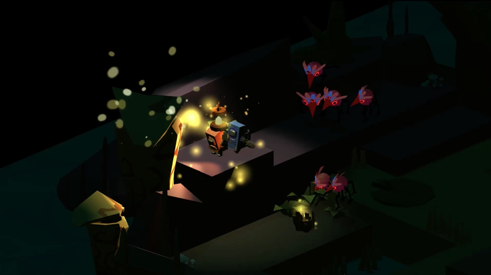
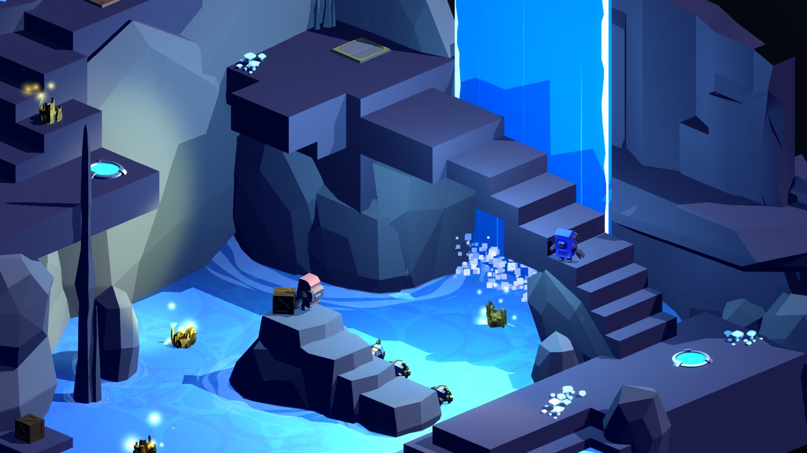
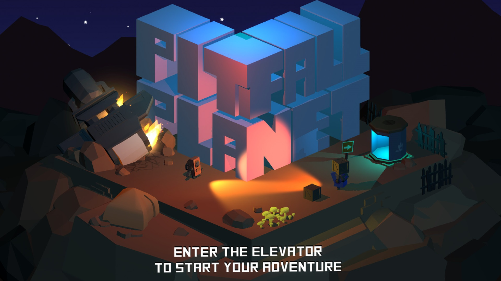

---
title: "Pitfall Planet"
weight: 20
platforms: ["Nintendo Switch"]
client: "Abstraction Games"
developer: "Bonfire Games"
publisher: "Abstraction Games"
website: "https://www.nintendo.com/games/detail/pitfall-planet-switch"
featured_image: "featured.jpg"
draft: false
---

Pitfall Planet is a two-player co-operative puzzle-solving adventure game that takes place on a distant, forgotten mining world. Two astrobots, recently stranded and separated from their ship, must traverse the subterranean caves of the ruined planet and overcome its many perils in the process.



In Pitfall Planet, you and your friend are equipped with the latest and greatest in astro-miner technology! Players can use their grappling hooks to pick up objects (including each other!) and throw them over gaps or cliffs. To collect all the ore in each level, you'll learn to master buttons, crates, lanterns, bouncy pads, rockets, tanks, and more!

Guess that was the cutest game we ever ported from PC to Nintendo Switch. Our Software Engineer and QA Engineer did it well in four months, using Unity and C#.


  
  
  
  
  
  
