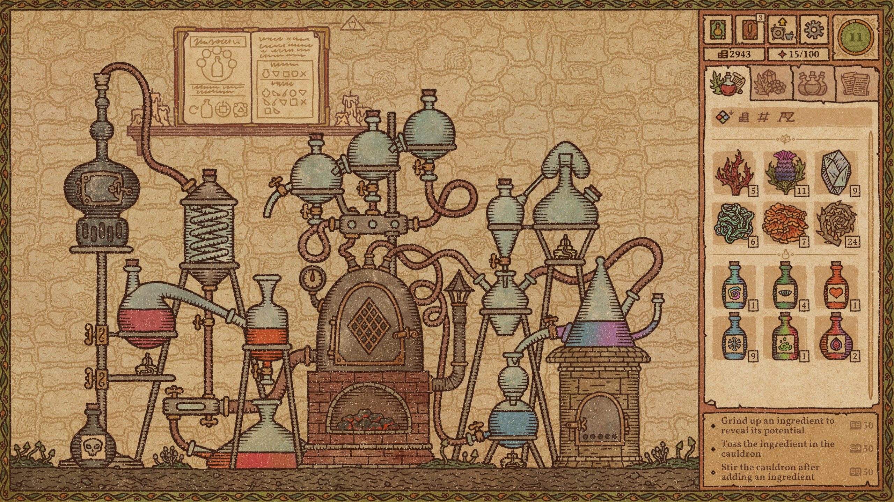
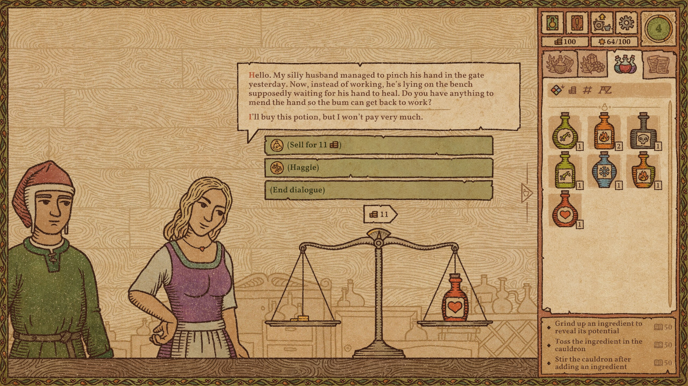
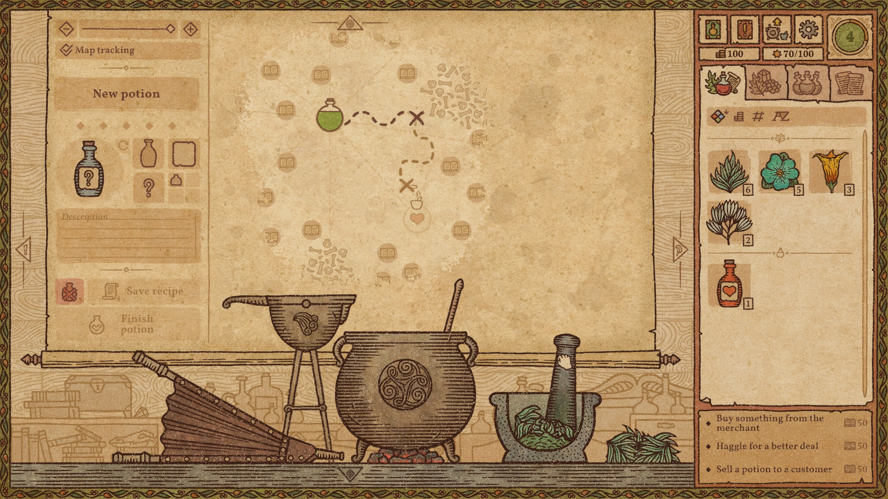

---
title: "Potion Craft: Alchemist Simulator"
weight: 55
platforms: ["Gamepass", "Nintendo Switch", "Windows", "Xbox Series X"]
client: "tinyBuild"
developer: "niceplay games"
publisher: "tinyBuild"
featured_image: "featured.jpg"
draft: false
---

Potion Craft is an alchemist simulator where you physically interact with your tools and ingredients to brew potions. You're in full control of the whole shop: invent new recipes, attract customers and experiment to your heart's content. Just remember: the whole town is counting on you.

**LEARN THE ART OF POTION MAKING**

Concoct your potion plan. Grind ingredients and carefully mix them in your cauldron. Heat the coals. Boil and stir. Add the base: water, oil, or… something else. Congrats on your first potion! Was it easy to learn? Now try mastering it!

**EXPERIMENT AND INVENT NEW RECEPIES**

Carefully plan your route via the Alchemy Map to combine different effects. Be mindful of common sense: you won’t find a market for a poisonous healing potion… right? Or would you?
 
**SELL POTIONS**

Every day customers will come to your store looking for solutions to their problems. You will face consequences depending on what you decide to sell them. Attract guilds, befriend notable figures (or feud with them), gain riches and influence - and one day, you may even decide the fate of the whole town.

**BUY INGREDIENTS OR GROW YOUR OWN**

Every alchemist needs ingredients. You can buy them from traveling merchants: it can be pricey, but successful haggling may save you some coin. Or you can just grow your own!

**GET CREATIVE WITH CUSTOMIZING**

Want to give a special appearance to your best potions? Go ahead! Change bottle shape, label type, icon, and colors. You can even give it a custom name and label description. Carefully arrange your unique potions to showcase them on your shop’s shelves and tables… or carelessly throw them around - we’re not gonna tell you what to do, just have fun!


  
  
  
  
