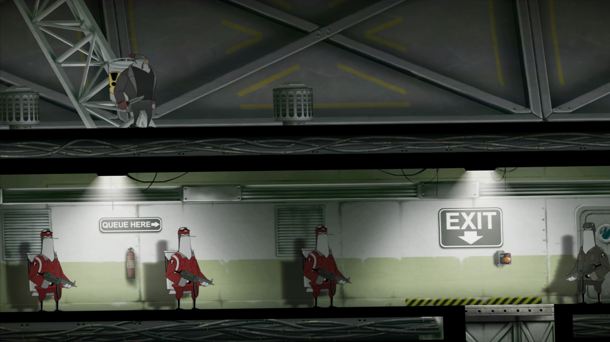
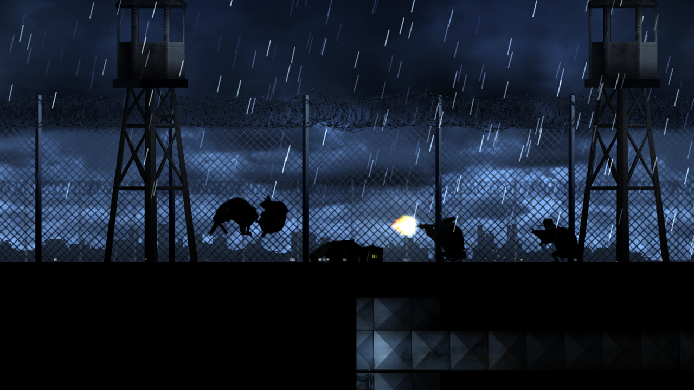
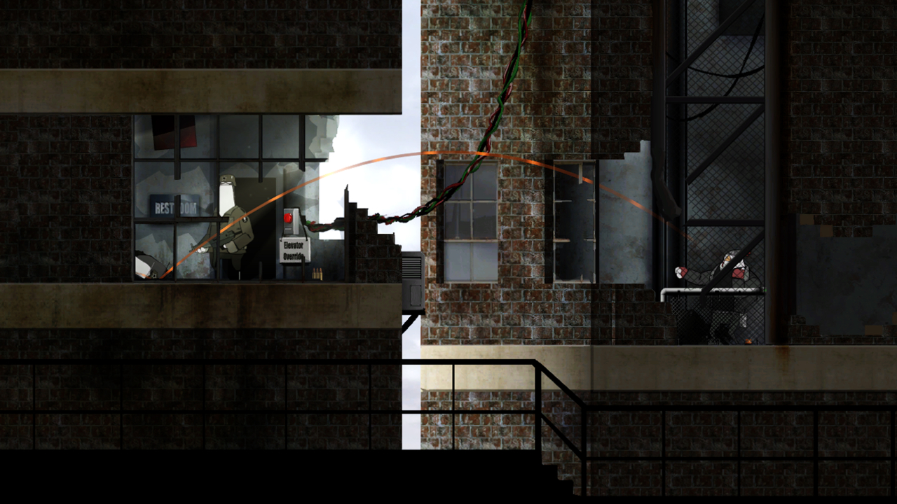
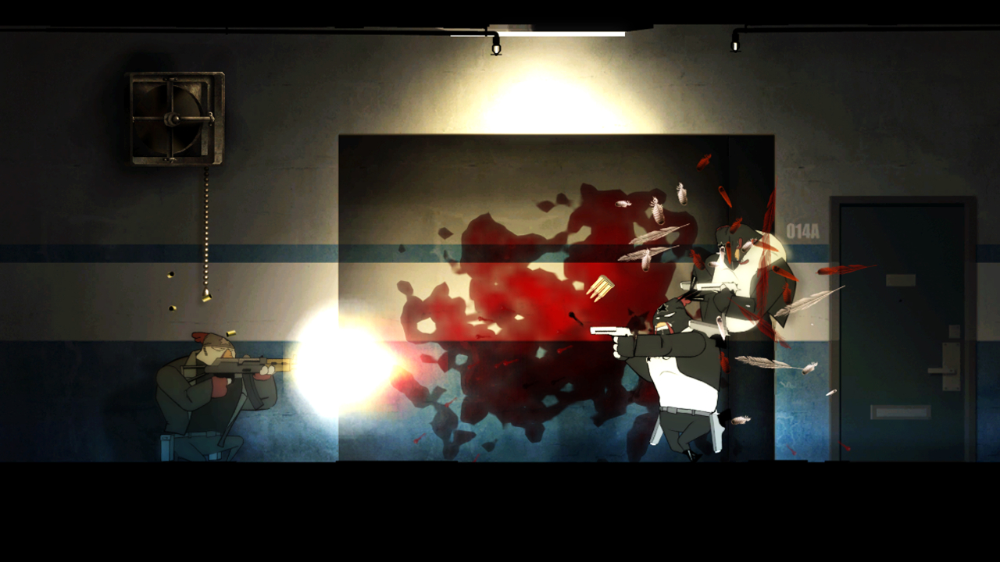
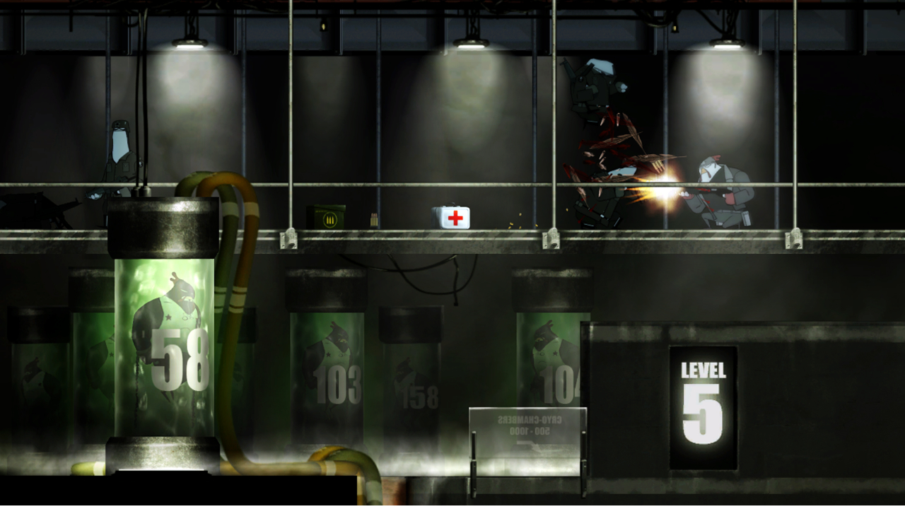
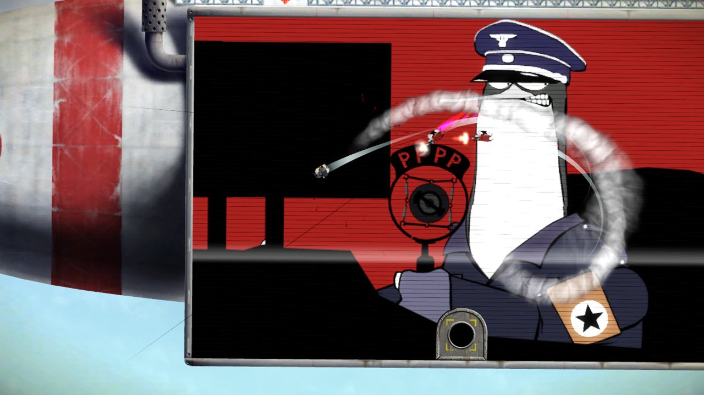

---
title: "Rocketbirds: Hardboiled Chicken (Remastered)"
weight: 33
platforms: ["Playstation 4"]
client: "Ratloop Asia"
developer: "General Arcade, Ratloop Asia"
publisher: "Ratloop Asia"
website: "https://store.playstation.com/en-cy/product/EP5015-CUSA17729_00-RB10000000000001?scope=sceapp"
featured_image: "featured.png"
draft: false
---

Rocketbirds: Hardboiled Chicken is a platform adventure game created and developed by Ratloop, and making a remastered PlayStation 4 version was a big project for General Arcade - two Software Engineers, two QA Engineers, Producer and Part-time artist took care of enhanced visuals and polished gameplay as well as added 4k support using PhyreEngine and C++.



Annihilate an evil penguin regime in this cinematic platform adventure game offering full solo and co-op campaigns!

Set out on a mission to assassinate the totalitarian penguin leader as Hardboiled Chicken. Destroy enemies with a slew of weapons and illuminate the secrets to his past while uncovering the real enemies of Albatropolis. Master fowl play in the co-op campaign as a pair of Budgie commandos on a mission to save the general’s daughter. Many lives will be destroyed, countless penguins will die!


  
  
  
  
  
  
