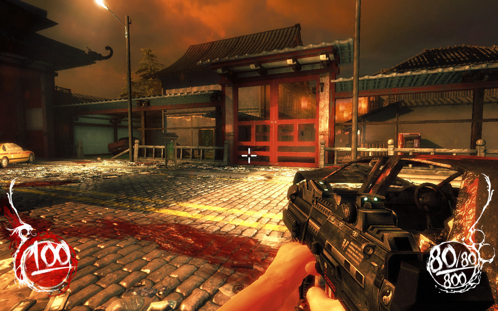
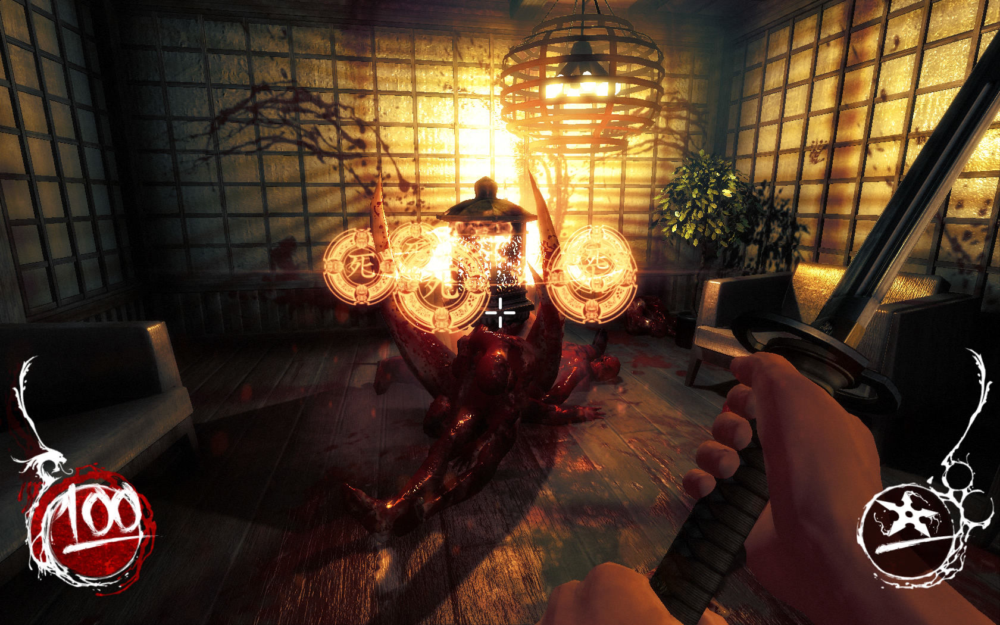
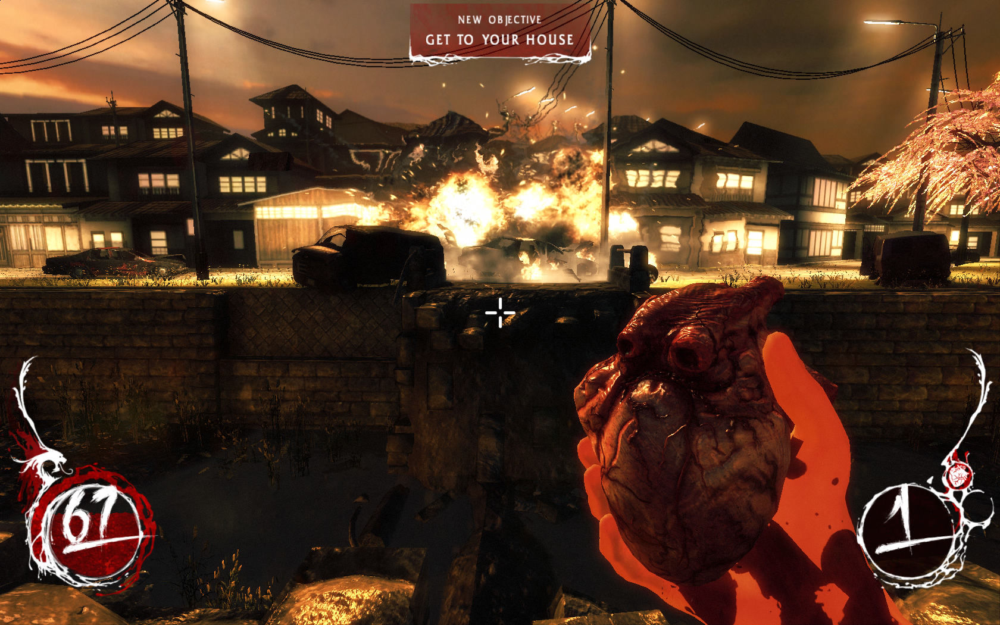
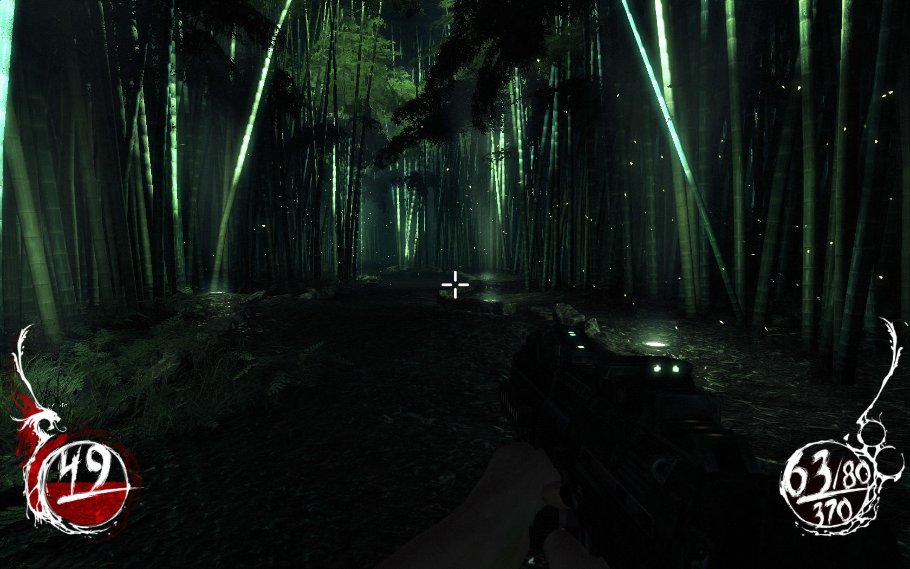
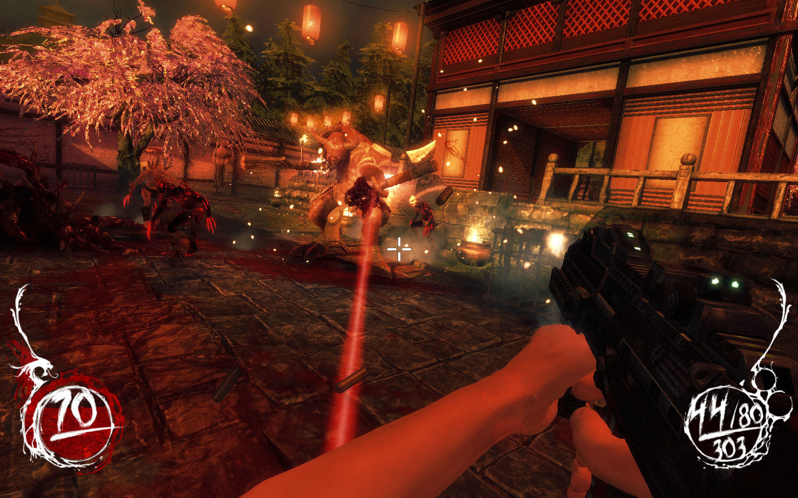

---
title: "Shadow Warrior (2013)"
weight: 9
platforms: ["Mac App Store", "OSX"]
client: "Devolver Digital"
developer: "Fliying Wild Hog"
publisher: "Devolver Digital"
website: "https://www.devolverdigital.com/games/shadow-warrior"
featured_image: "featured.png"
draft: false
---

Shadow Warrior is a bold reimagining of the classic 3D Realms’ shooter from independent developer Flying Wild Hog (Hard Reset) starring the legendary and quick-witted warrior Lo Wang. Combine the brute force of overwhelming firepower with the elegant precision of a katana to annihilate the merciless armies of the shadow realm in an exhilarating and visually stunning transformation of the classic first-person shooter.



Shadow Warrior tells the offbeat tale of Zilla Enterprise’s corporate shogun Lo Wang as he is ordered to acquire a legendary blade of limitless power by his deceitful employer. Betrayed and left for dead, Lo Wang learns of the blade’s connection to ancient gods from another realm preparing to push our world to the brink of destruction. Now the reluctant hero must become legend through a masterful combination of gun, blade, magic and wit to uncover the truth behind the demonic invasion and banish evil back into the darkness.

This game is definitely one of the best First Person Shooters in the world! And that was a great experience for one of our Software Engineers to prepared Mac App Store version. It took him a month, Custom engine and C++ were used.


  
  
  
  
  
  
