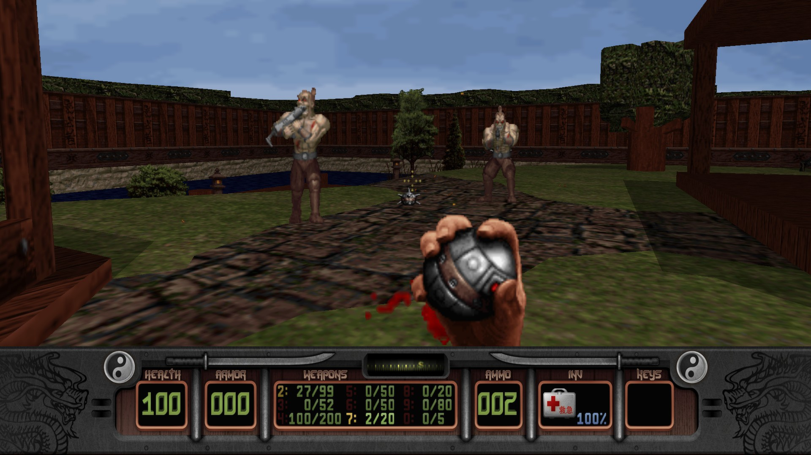
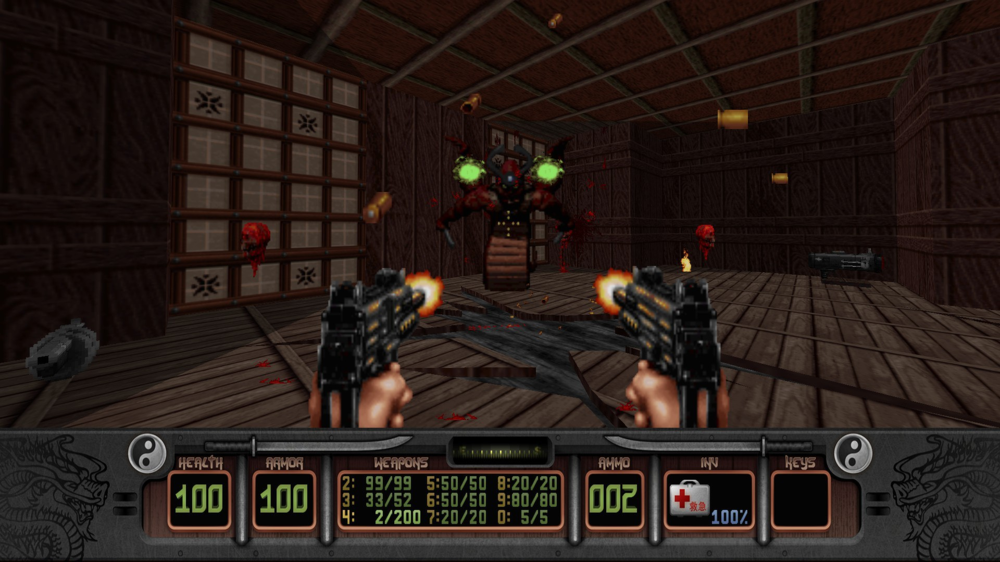
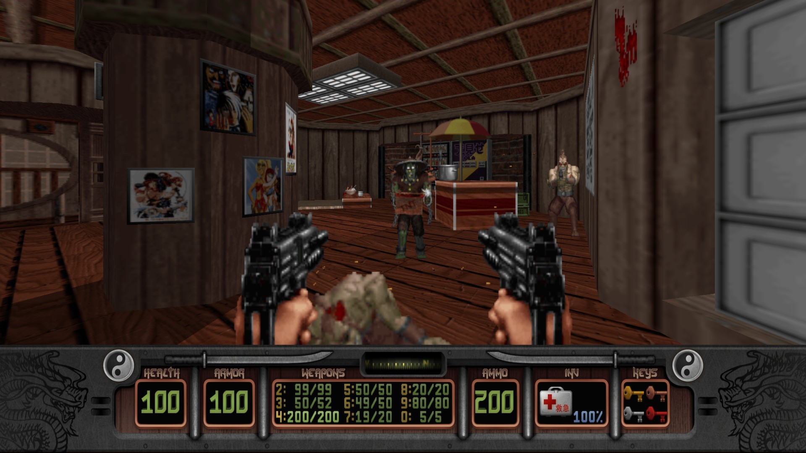

---
title: "Shadow Warrior Classic Redux"
weight: 2
platforms: ["Android", "GOG Galaxy", "iOS", "Linux", "OSX", "Steam", "Windows"]
client: "Devolver Digital"
developer: "3D Realms, General Arcade"
publisher: "Devolver Digital"
website: "http://store.steampowered.com/app/225160/"
featured_image: "featured.png"
draft: false
---

The definitive version of the cult classic shooter, Shadow Warrior Classic Redux features remastered visuals and two massive expansion packs. Corporations rule every facet of life in a near-future Japan and employ Shadow Warriors, one-man armies of unparalleled skill, to protect their power and forcefully remove all opposition.



The Zilla Corporation is the most powerful of these conglomerates and will stop at nothing to achieve domination unseen by any other corporation in the world. Lo Wang, Zilla Corporation’s legendary Shadow Warrior, discovers this corruption and the dark powers being summoned to aid his employers in this quest for absolute power. As a man of honor, Lo Wang vows to battle these demonic forces with an arsenal of explosive weapons, his silent blade, and a razor sharp wit.

Two of General Arcade's Software Engineers and an Artist developed a modern port with enhancements for PC and mobile. BUILD, C, C++, OpenGL/OpenGLES.


  
  
  
  
  
  
