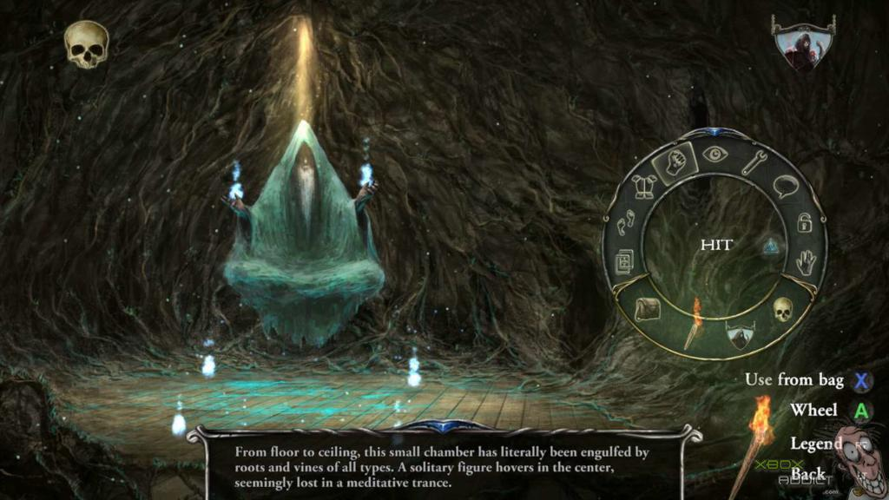
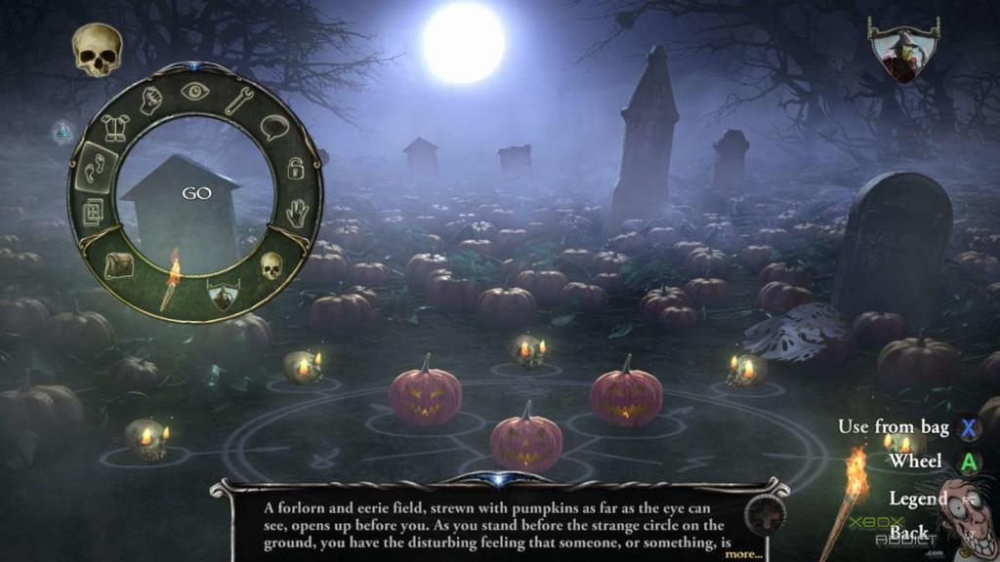
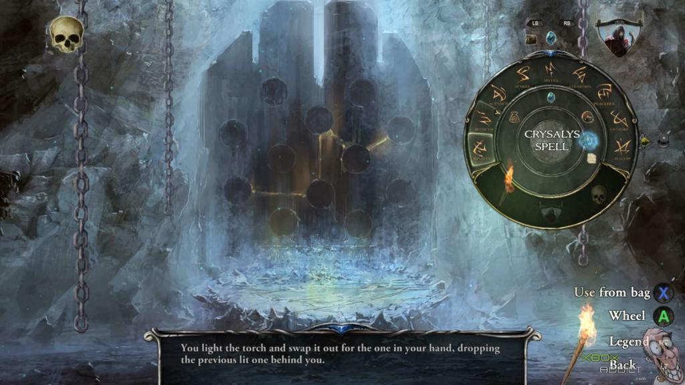
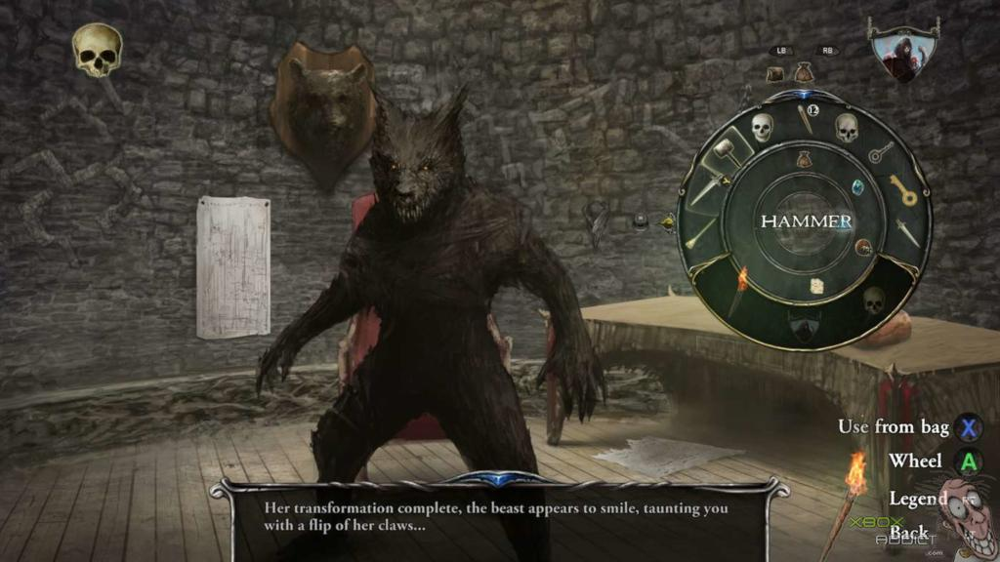
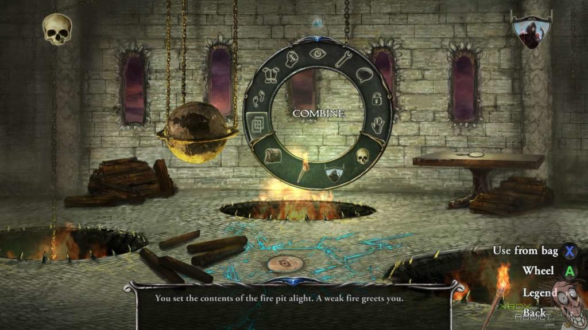

---
title: "Shadowgate"
weight: 19
platforms: ["Nintendo Switch", "Playstation 4", "Xbox One"]
client: "Abstraction Games"
developer: "Zojoi"
publisher: "Abstraction Games"
featured_image: "featured.jpg"
draft: false
---

Shadowgate is one of the most well-known and beloved adventure titles in gaming history. It quickly endeared players with its fantastic atmospheric soundtrack, perilous locations to progress through, countless puzzles to solve, and more ways to gruesomely die than gamers previously thought possible. Thrust into the role of “The Seed of Prophecy”, players travel deep into the castle, in hopes of defeating the evil that dwells within - the dreaded Warlock Lord.



Three or our Software Engineers, QA Engineer and Producer ported the remaster of this classic adventure game to Xbox One, Switch and PlayStation 4. All we needed was Unity and C# together with seven months.

The new console versions builds upon the massively re-imagined remake of the original Shadowgate and features a refined user interface and intuitive wheel-based icon command system to help players along on their quest. Get ready brave adventurer, the Living Castle awaits!


  
  
  
  
  
  
