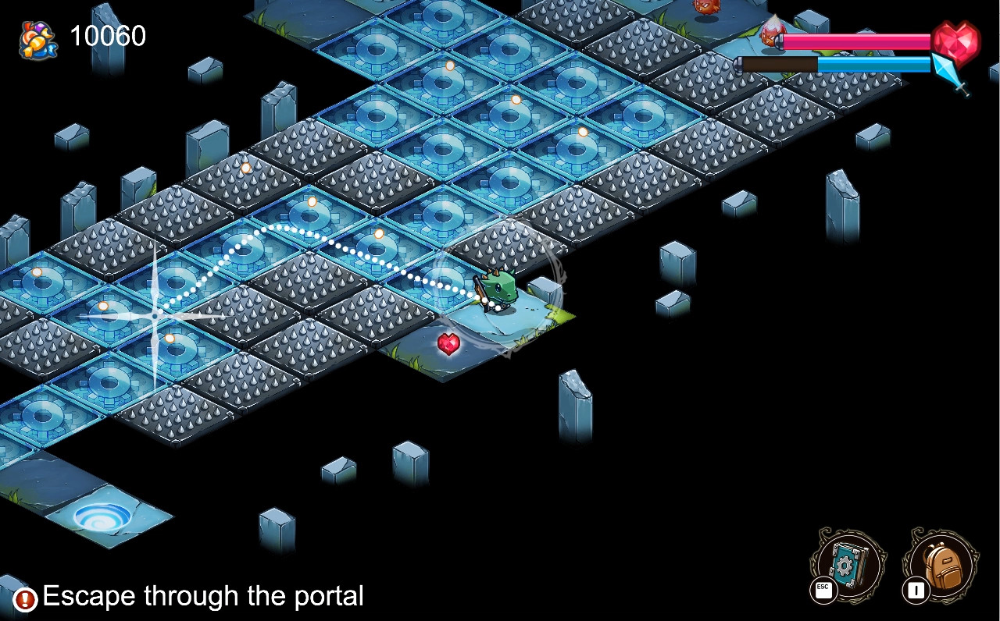
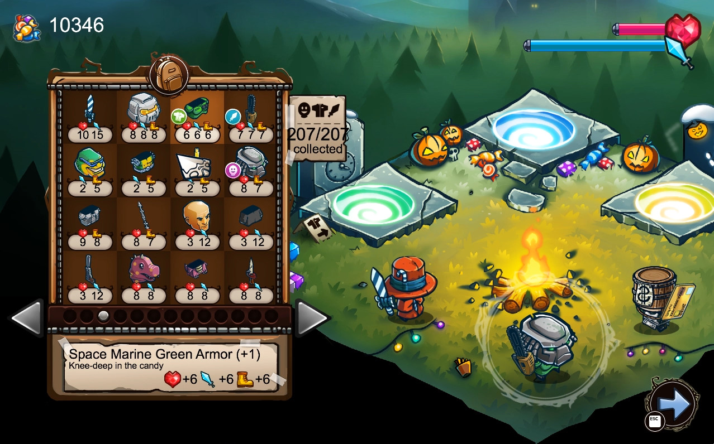
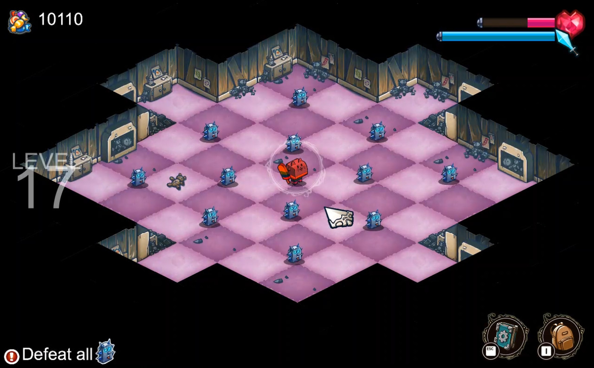
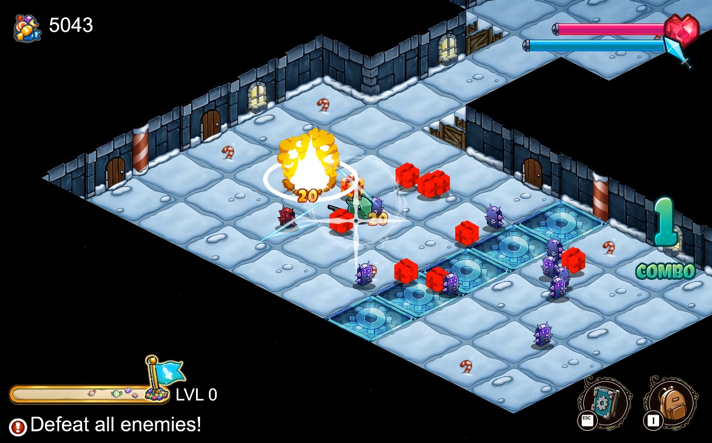
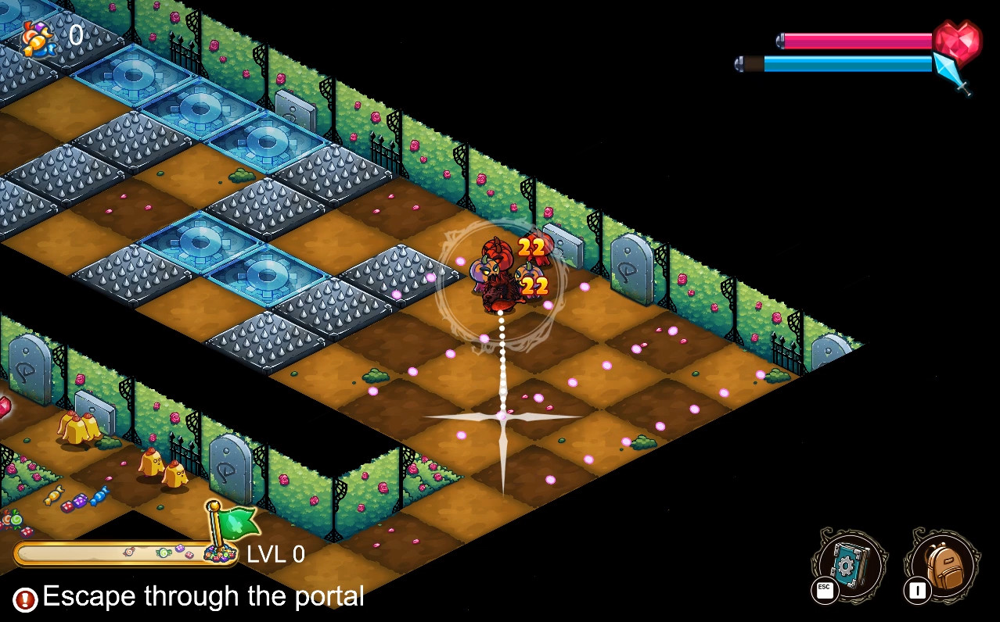

---
title: "Slashy Hero"
weight: 11
platforms: ["Steam", "Windows"]
client: "Kongregate, The Gentlebros"
developer: "General Arcade, The Gentlebros"
publisher: "Kongregate"
website: "http://store.steampowered.com/app/525740/"
featured_image: "featured.png"
draft: false
---

Slashy Hero is an isometric action game where you can draw a path to slash your enemies! Play through 96 fun levels filled with traps and ghastly enemies! Test your skills in the Infinite Dungeon against an endless horde of enemies, and collect over 200 costume parts to be the Hero that you want to be!



Our Software Engineer ported the game from mobile platforms to PC, changed in-game economy and added new content as well as integrated Steamworks features (achievements, leaderboards, steam controller, steam cloud, trading cards). It was three months of work with Cocos2dx and C++.


  
  
  
  
  
  
