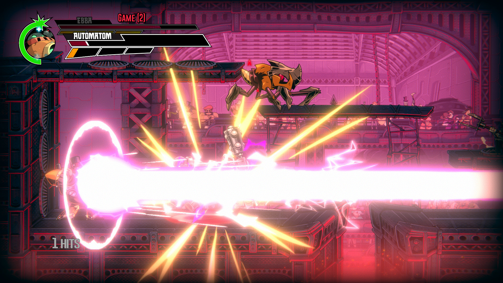
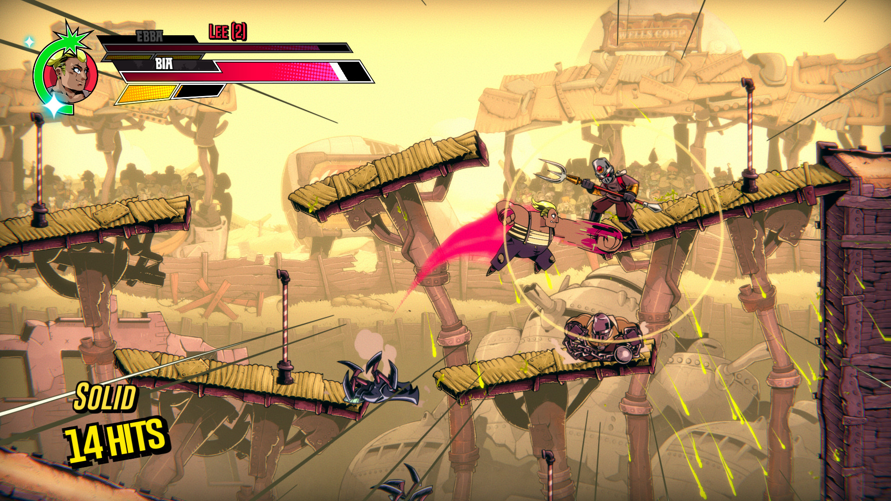
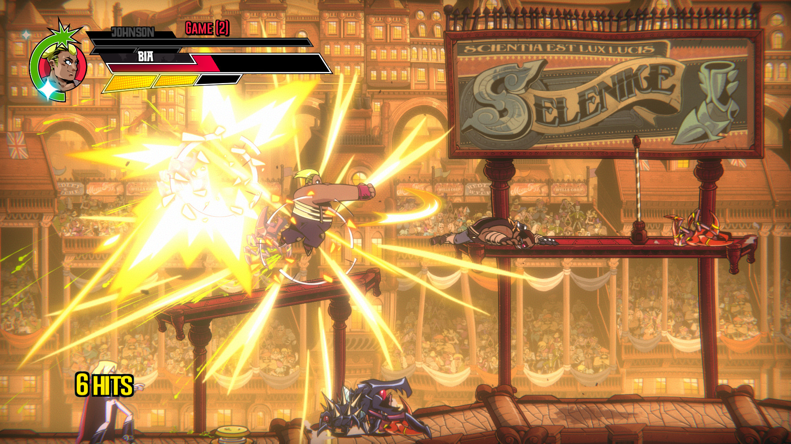
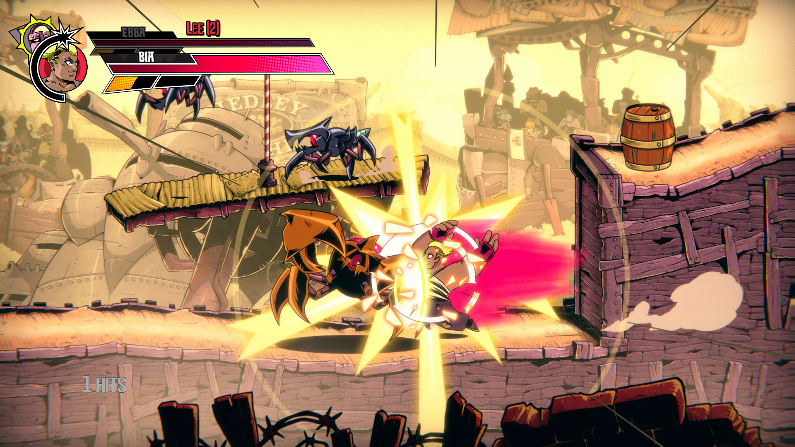
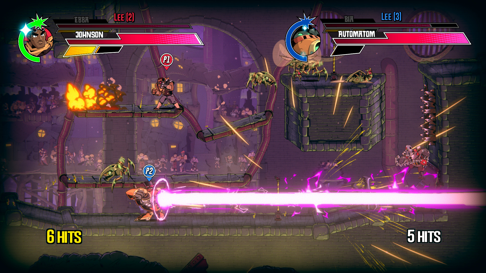

---
title: "Speed Brawl"
weight: 40
platforms: ["Cross Play", "Epic Games Store", "GOG Galaxy", "Nintendo Switch", "Playstation 4", "Steam", "Windows", "Xbox One"]
client: "Double Stallion Games"
developer: "Double Stallion Games"
publisher: "Double Stallion Games"
website: "https://speedbrawl.com/"
featured_image: "featured.png"
draft: false
---

London, 1888. After a decade of war with the Lunar invaders we named the Selenites, the British Empire finally vanquished the insect-like menace thanks to a dashing officer by the name of Hugo Wells. He crushed the colony’s queen and in doing so cemented his status as both a hero of the empire, and the de facto patriarch of the drone-like Selenites.

Following the war, the Selenites became the new workforce of our industrial revolution, ushering in a new era of progress and prosperity. Freed from the shackles of employment, man could pursue more earthly endeavors. However, listlessness and disobedience rampaged throughout the middle and working classes. In order to satiate the masses, Hugo Wells conceived of the ultimate entertainment. An elite sport where only the bravest, the fastest and the most worthy warriors could wage a petty war against the enslaved Selenite hordes. Welcome… to Speed Brawl!



Speed Brawl is a 2D combat-racer about moving fast and hitting hard! Maintain your momentum, build your combos, and unleash powerful special moves. Find your own fighting style, and assemble the finest team of brawlers ever seen. Then do it all again faster&#8230; faster&#8230; FASTER!!!

General Arcade worked on Speed Brawl for eight months. Three programmers and two testers used Unity, C# and C++ to make cross-platform multiplayer for PlayStation 4, Xbox One, Nintendo Switch, Steam, GOG and EGS via Epic Online Services.


  
  
  
  
  
  
