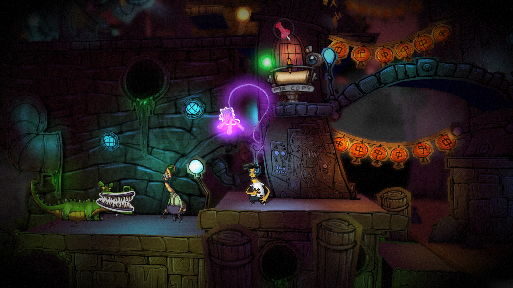
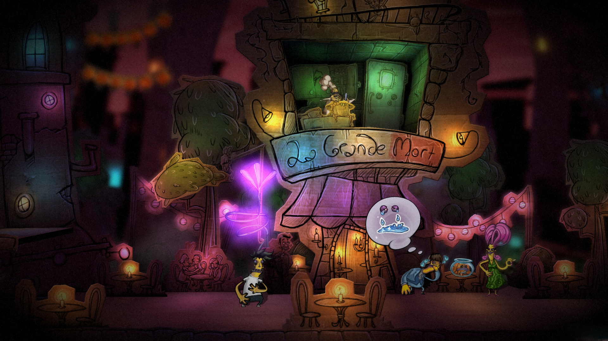
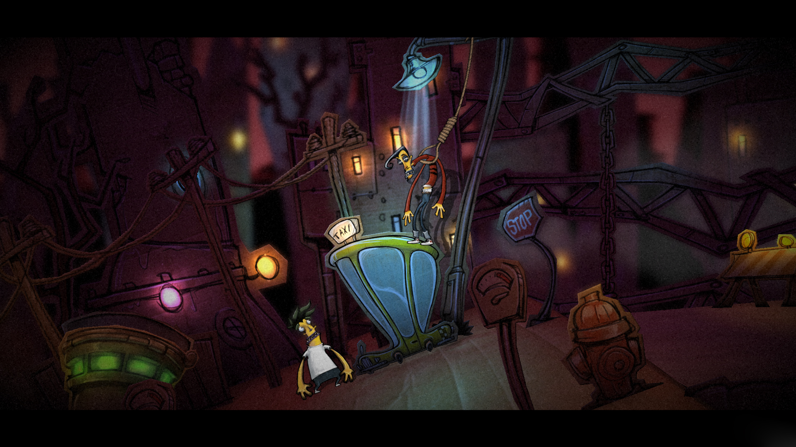
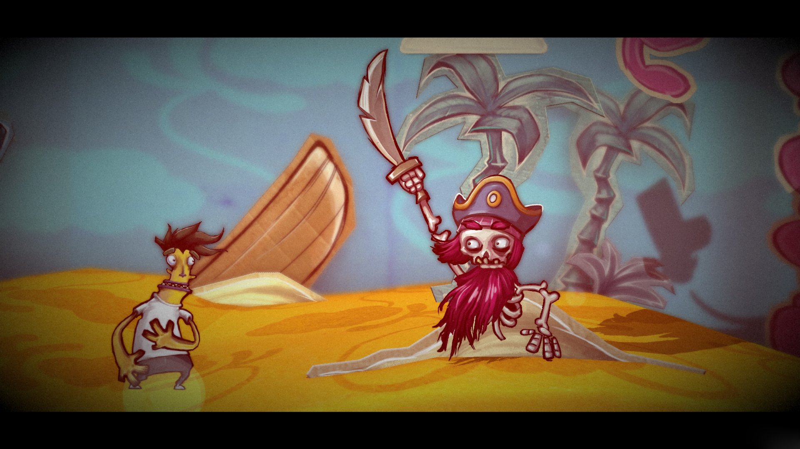
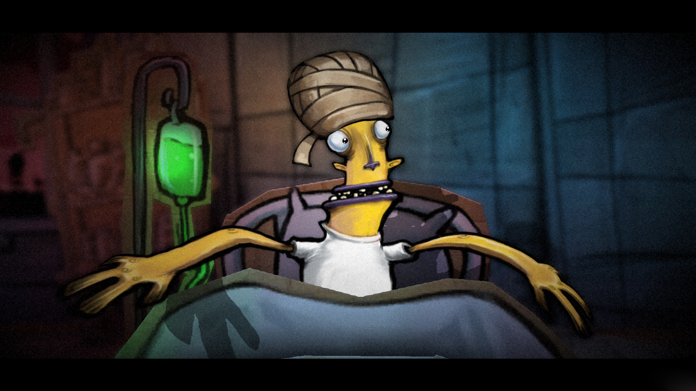

---
title: "Stick It To The Man!"
weight: 30
platforms: ["Epic Games Store", "Windows"]
client: "RipStone"
developer: "Zoink"
publisher: "RipStone"
website: "https://www.epicgames.com/store/en-US/product/stick-it-to-the-man/home"
featured_image: "featured.png"
draft: false
---

Meet Ray, he lives in a world where everything is made out of paper and stickers. One day he has an accident and wakes up with a giant pink spaghetti arm sticking out of his brain. This gives him awesome powers and he can suddenly change the world around him by folding it, tearing it, pulling stickers off and sticking them elsewhere! And if that weren't enough, Ray can also read peoples minds!



Digging into the brains of his fellow citizens, Ray can hear their thoughts and use that to his advantage. Unfortunately, Ray doesn't have much time to get to grips with his new abilities. He is framed by &#8216;The Man' with a crime he didn't commit, and is on the run. Can you help to get Ray out of this sticky situation? 

What about us, we already helped him in some way! General Arcade prepared Epic Games Store release and integrated Epic Online Services - Software Engineer and QA Engineer worked with Unity, C# and C++ for two weeks. All development done without access to the source code using Ghost Porting technique.


  
  
  
  
  
  

