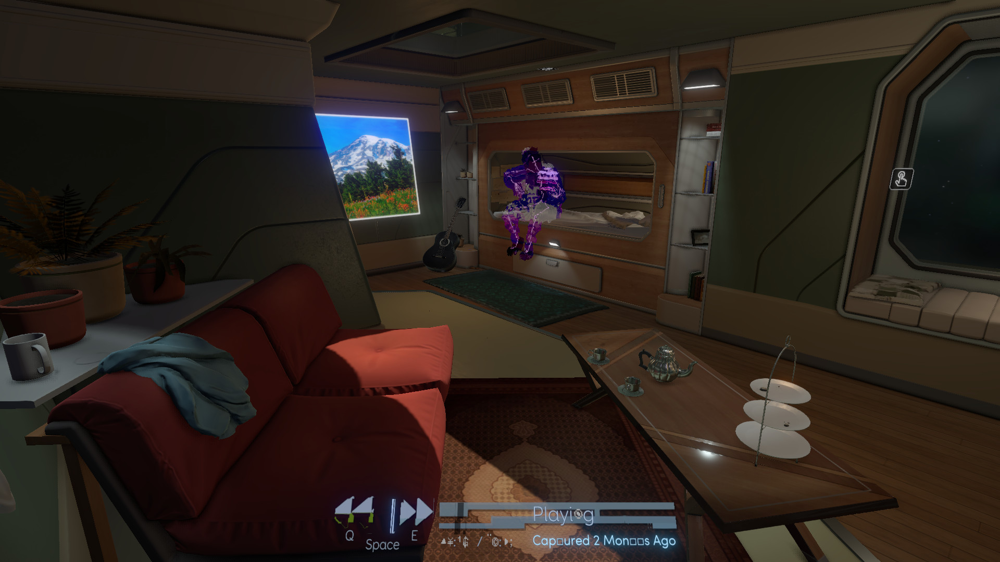
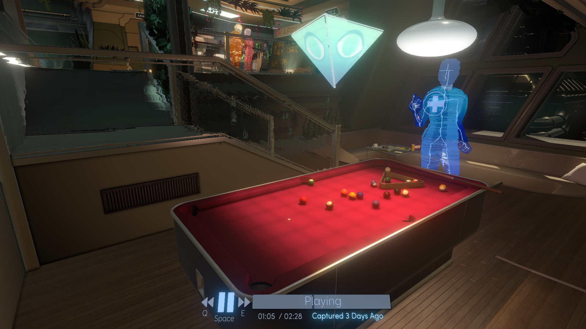
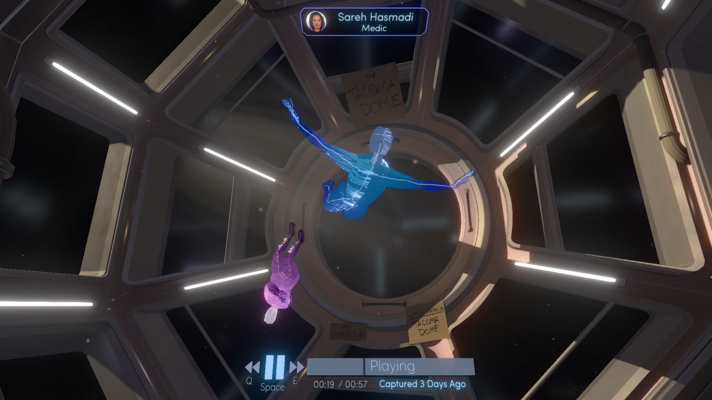

---
title: "Tacoma"
weight: 18
platforms: ["Mac App Store", "OSX"]
client: "Fullbright"
developer: "Fullbright"
publisher: "Fullbright"
website: "https://tacoma.game/"
featured_image: "featured.png"
draft: false
---

Tacoma is a narrative adventure set aboard a high-tech space station in the year 2088. As you go about your mission, you'll explore every detail of how the station's crew lived and worked, finding the clues that add up to a gripping story of trust, fear, and resolve in the face of disaster.



At the heart of Tacoma is the facility's digital surveillance system, which has captured 3D recordings of pivotal moments in the crew's life on the station. As you explore, echoes of these captured moments surround you. you'll use your ability to rewind, fast-forward, and move through the physical space of these complex, interwoven scenes to examine events from every angle, reconstructing the multi-layered narrative as you explore.

Our Software Engineer was the main guy to prepared Mac App Store version. All he needed was two weeks and Unity with C#.


  
  
  
  
  
  
