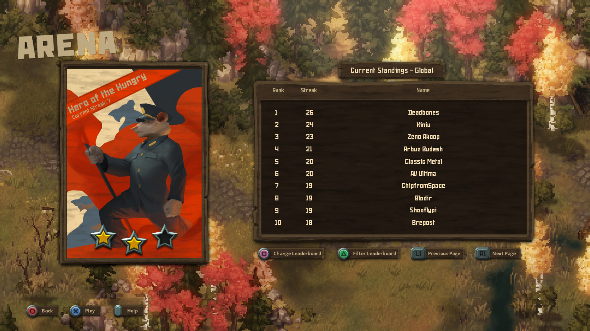

---
title: "Tooth and Tail"
weight: 15
platforms: ["Cross Play", "GOG Galaxy", "OSX", "Playstation 4", "Steam", "Windows"]
client: "GOG"
developer: "Pocketwatch Games"
publisher: "Pocketwatch Games"
website: "https://www.gog.com/game/tooth_and_tail"
featured_image: "featured.png"
draft: false
---

Tooth and Tail is a Real-Time-Strategy game featuring Single Player, Online Competitive Play, Split Screen, Replays, and more. Lead the revolution with an army of flamethrowing Boars, mustard gas-lobbing Skunks, and paratrooper-puking Owls. Build a base, lead your army, eat your enemies!



The Longcoats, the Commonfolk, the KSR, and the Civilized are in the midst of a Civil War over who gets to eat, and who has to be the meat. A darkly humorous tale of riots and revolution is told through an extensive Single Player campaign. With procedurally generated maps and customizable factions, no two conflicts will be the same, forcing players to strategize rather than memorize.

Our Software Engineers (two of them to be more precise) integrated Galaxy features (achievements, leaderboards, cloud saves) and Galaxy Crossplay (online multiplayer between GOG, Steam, PS4) to Tooth and Tail. MonoGame, C# and Galaxy Crossplay were used.


  
  
  
  
  
  
