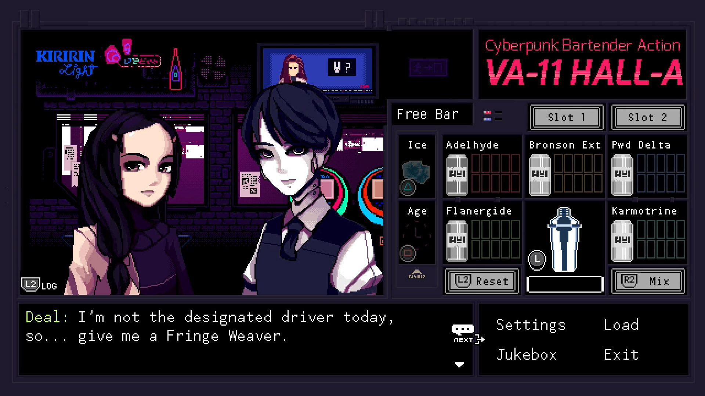
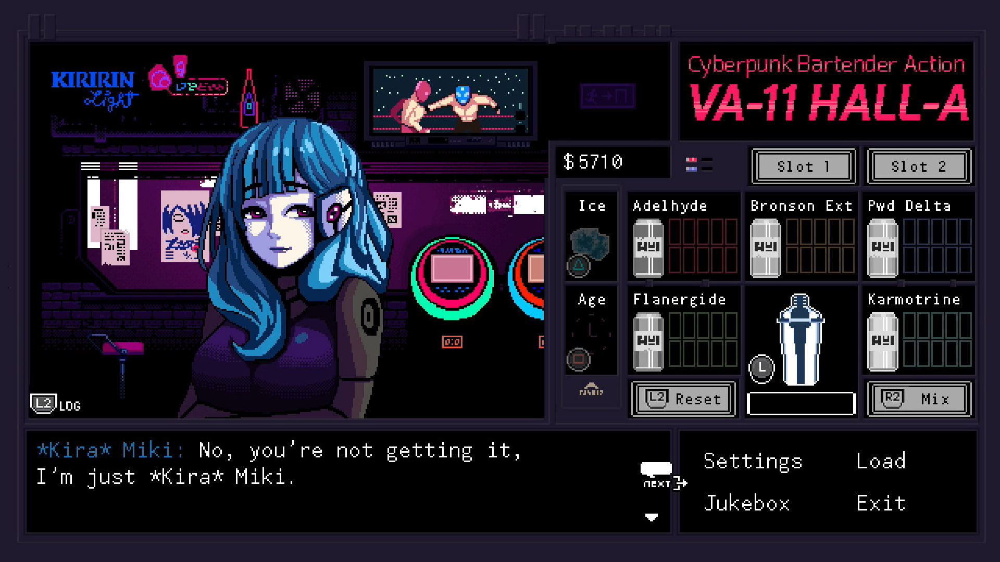
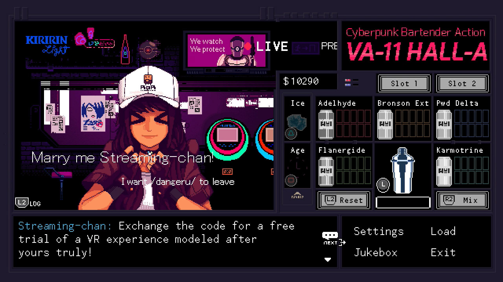
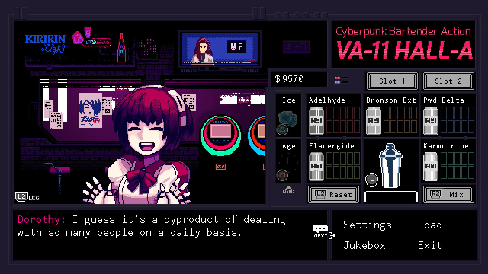

---
title: "VA-11 Hall-A: Cyberpunk Bartender Action"
weight: 21
platforms: ["Nintendo Switch", "Playstation 4"]
client: "Ysbryd Games"
developer: "SUKEBAN GAMES"
publisher: "Playism, Ysbryd Games"
featured_image: "featured.jpg"
draft: false
---

Welcome to VA-11 Hall-A! In this world, corporations reign supreme, all human life is infected with nanomachines designed to oppress them, and the terrifying White Knights ensure that everyone obeys the laws. But, this story is not about those people.



We were the ones who ported the original PC game to Nintendo Switch and Sony PlayStation 4 - two Software Engineer, QA Engineer and Part-time artist needed four months and GameMaker Studio 2 to do it. So now you can turn to a bartender at VA-11 Hall-A, affectionately nicknamed &#8216;Valhalla.' Although it is just a small bar in downtown Glitch City, it attracts the most fascinating people this side of dystopia. Keep your clients lubricated and you will be made privy to the most interesting stories.

The experience of VA-11 Hall-A offers a branching storyline where your decisions do not depend on traditional choices, but through the drinks you prepare. Get to know your clients, their tastes, and prepare the drink that will change their lives.


  
  
  
  
  
  
