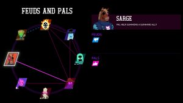
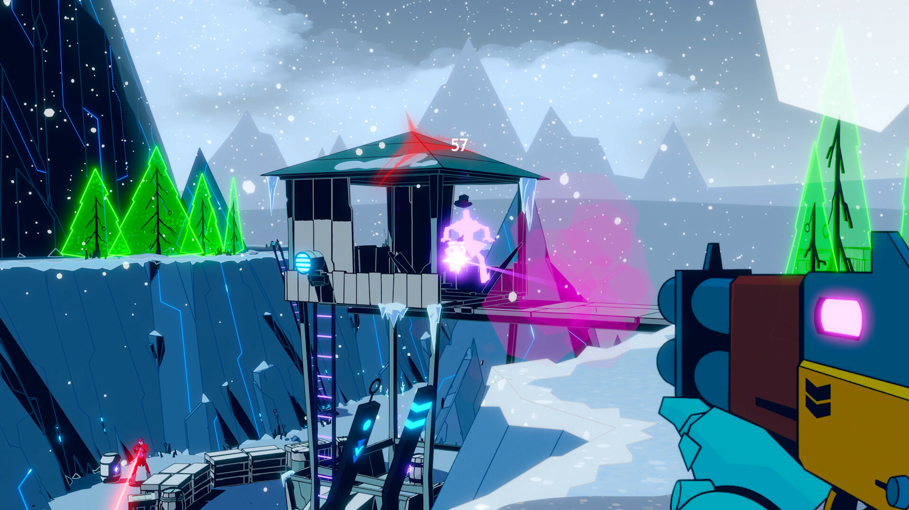
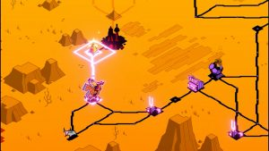

---
title: "Wild Bastards"
weight: 74
platforms: ["Nintendo Switch", "Playstation 5", "Xbox Series X/S"]
client: "Blue Manchu"
developer: "Blue Manchu"
publisher: "Humble Games"
featured_image: "featured.jpg"
draft: false
---

<!-- The spiritual successor to the award-winning game Void_Bastards, **Wild Bastards** is a roguelike strategy shooter with heart-pounding FPS action, mod management, and a tactical campaign. Saddle up and lead the most notorious outlaws in the galaxy.

From the veteran team behind Void Bastards and Card Hunter, **Wild Bastards** has you travel from planet to planet to recruit, manage and gun sling with a team of 13 outlaws, each of whom has their own weaponry, special power, and growth tree. On planets, you’ll wrangle loot and start showdowns that are then played out in intense, bite-sized shootouts.

The **Wild Bastards** were the most deadly gang in the galaxy until a posse from the puritanical magnate Jebediah Chaste eliminated one outlaw after another. Faced with their own mortality, the two remaining members have teamed up with the Drifter, a mysterious sentient spacecraft, to find and resurrect the dead gang members as they flee to the mythical Homestead.

**Intense Showdowns**

Prove you’re the ultimate gunslinger by blasting an array of enemies in bullet-flying shootouts.

**Tactical FPS Combat**

Use your wits to overcome crafty enemies that utilize cover, flank you, and employ a huge variety of special moves from teleportation to homing poisonous quills.

**13 Outlaws to Play**

Rebuild a gang of 13 outlaws, each with their own unique weapon, stunt, personality, relationships, and ability tree.

**Build & Maintain Relationships**

The gangs know each other well, but that doesn’t mean they like each other. It’s your job to manage their dynamic relationships, but good luck getting feuding outlaws to ride together.

**Keep The Gang Thriving**

Accumulate resources to heal injured gang members, level up characters, improve relationships, and more.

**Strategize for Victory**

Evaluate each planet’s terrain, enemies, and traits before selecting which gang members you want to land there. Collect items, level up, and use special locations carefully to turn the odds in your favor!

**Challenge Mode**

After completing the main campaign, a challenge mode unlocks to offer a sequence of challenge sectors with increasingly difficult levels and mutators to modify the play experience.

**An Ever-Changing, Lawless Galaxy**

Roam the procedurally-generated galactic sectors and planets with varying parameters such as gravity, terrain features, weather, and more.

**Our work: **

General Arcade specialists ported **Wild Bastards** to Xbox Series X/S, PlayStation 5, and Nintendo Switch. After completing the porting process, we conducted thorough compliance testing to ensure that all versions of the game met the strict standards and requirements of each platform.













**Our work: **

General Arcade specialists ported **Wild Bastards** to Xbox Series X/S, PlayStation 5, and Nintendo Switch. After completing the porting process, we conducted thorough compliance testing to ensure that all versions of the game met the strict standards and requirements of each platform.



 -->


  
  
  
  
  
  
