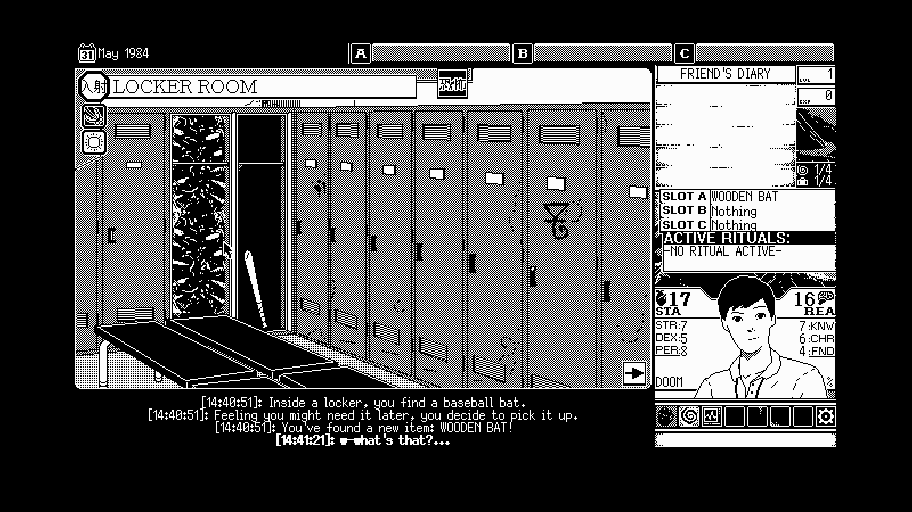
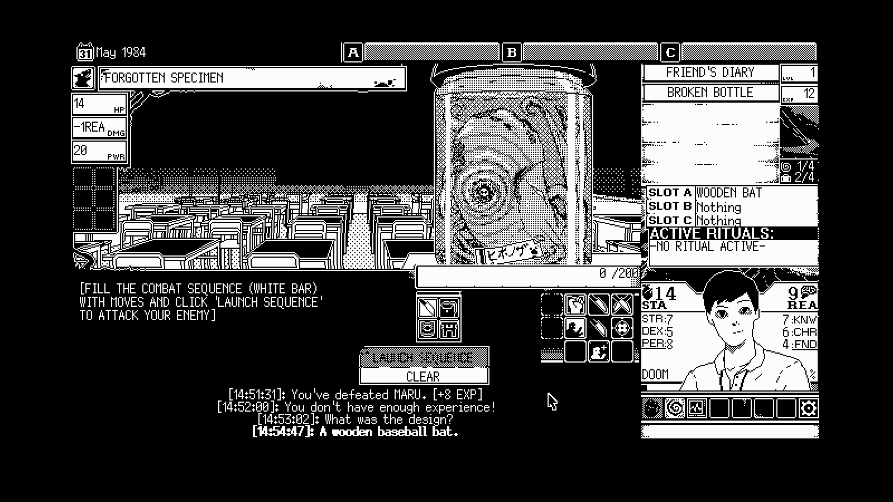
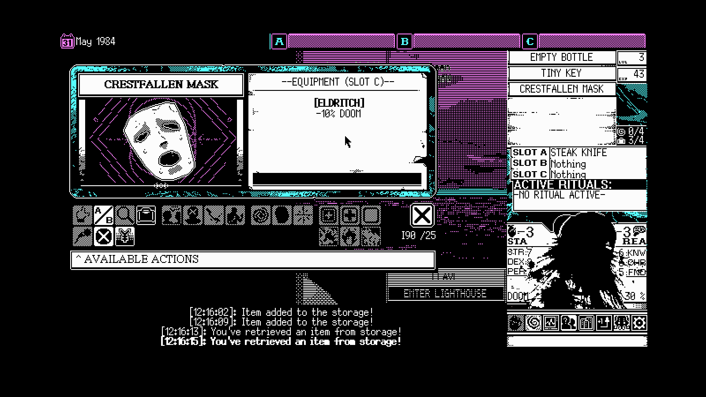
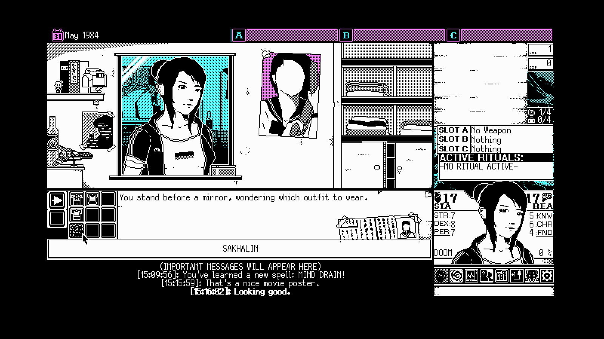
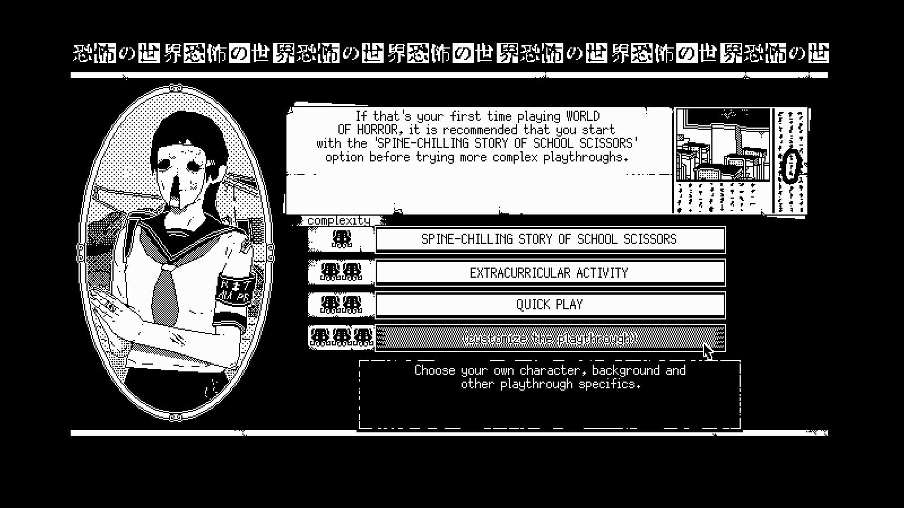

---
title: "WORLD OF HORROR"
weight: 68
platforms: ["Nintendo Switch", "Playstation 4", "Playstation 5"]
client: "Ysbryd Games"
developer: "panstasz"
publisher: "Playism, Ysbryd Games"
featured_image: "featured.jpg"
draft: false
---

General Arcade proudly presents the port of the acclaimed horror game. The project was worked on by one programmer, a QA specialist and a producer. Our team in a few months brought the project to a high-quality state that will give console gamers an unforgettable experience.




  
  
  
  
  
  
