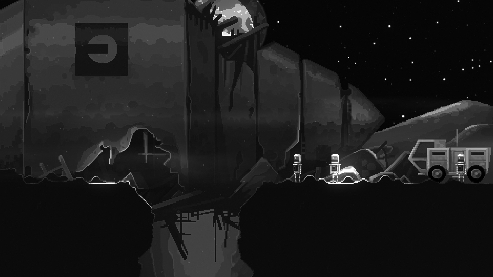
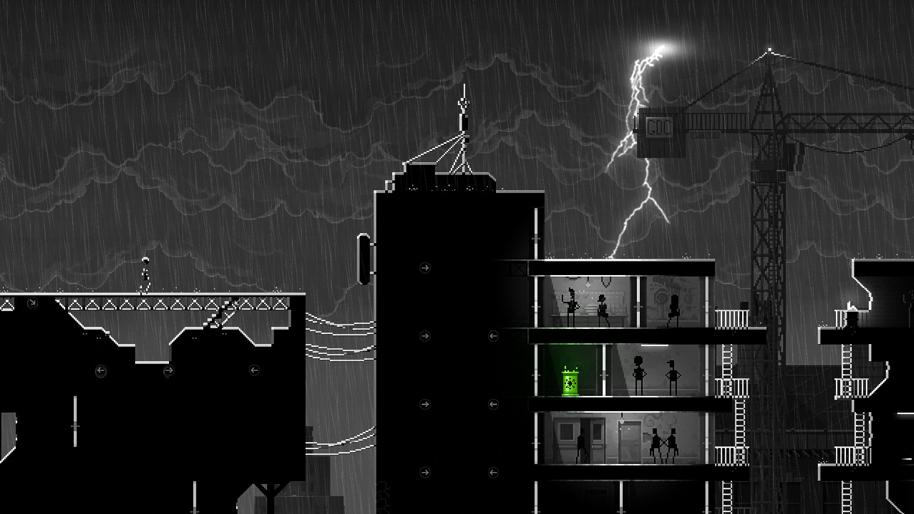
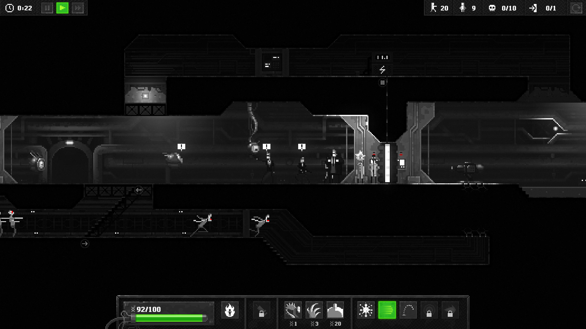

---
title: "Zombie Night Terror"
weight: 12
platforms: ["Mac App Store", "OSX"]
client: "Good Shepherd Entertainment"
developer: "NoClip"
publisher: "Good Shepherd Entertainment"
website: "https://www.zombienightterror.com/"
featured_image: "featured.png"
draft: false
---

Prepare yourself for the most thrilling night of your life! Something strange has happened and people everywhere are turning into blood thirsty walking corpses. But guess who’s the brains behind this hungry undead army? YOU! So spread this pandemic to wipe humanity of this planet. Because the only way to survive the zombie apocalypse, is to BE the apocalypse!



Spread terror through 40 levels and enrol more zombies into your undead army. Along the way you’ll have to solve brain tingling puzzles, and fight increasingly powerful foes that are hell-bent on staying alive. The closer you get to total world extinction, the harder survivors will fight to put you in the ground….for good. Blood, tears, non-sexual moans, inappropriate laughter, and tons of puzzles that will literally blow your brains out&#8230; This is Zombie Night Terror!

And one of our Software Engineers will help you to survive on Mac as well as on PC - he spent three weeks to prepare Mac App Store version. Unity and C# were used.


  
  
  
  
  
  
